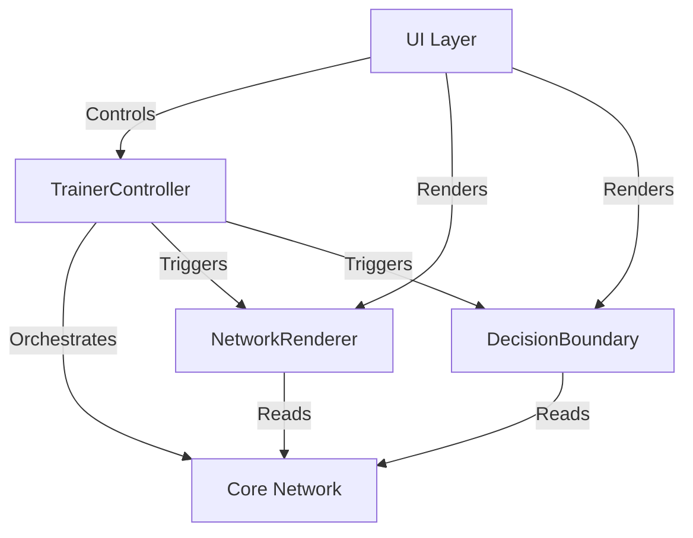

# Glass Box AI

> A transparent, interactive neural network engine in vanilla JavaScript. **Visibility first, performance second.**


## Mission

Unlike standard ML libraries (TensorFlow, PyTorch) which are "black boxes" optimized for speed, **Glass Box AI** is designed for **understanding**. We sacrifice raw performance for absolute visibility, allowing you to see the mathematical "thoughts" of the AI as they happen.

Think of it like opening up a mechanical watch to see the gears turning—we're doing that for Artificial Intelligence.

## Features

- ✅ **No libraries**: Pure vanilla JavaScript with zero ML dependencies
- ✅ **Backpropagation from scratch**: Implements the full forward/backward pass
- ✅ **Educational JSDoc**: Every function explains the math behind it
- ✅ **Activation functions**: Sigmoid and ReLU with derivatives
- ✅ **Input validation**: Clear error messages for debugging
- ✅ **Static Visualization**: Render any network architecture
- ✅ **Real-time Training Animation**: Watch weights evolve
- ✅ **Decision Boundary Heatmap**: Visualise the 2D decision space

## Quick Start

### Installation

```bash
cd "The Glass Box AI"
npm install
```

### Run Visual Demo

```bash
npm run dev
```

Then open the URL shown (usually http://localhost:5173).
- **Start**: Begin the training loop.
- **Reset**: Re-initialize weights.
- **Architecture**: Switch between network sizes.
- **Heatmap**: Observe the learning process in 2D.

### Run Tests

```bash
npm test
```

## Architecture



## How Backpropagation Works (In This Codebase)

### Forward Pass

Data flows from input to output. For each neuron:

```
z = dot(weights, inputs) + bias    # Pre-activation
a = activation(z)                   # Activation (output)
```

### Backward Pass

Error flows from output to input. We compute **delta** (δ = dLoss/dz) for each neuron:

**Output layer:**
```
δ = (a - target) * f'(z)
```

**Hidden layers:**
```
δ = (Σ w_next * δ_next) * f'(z)
```

### Weight Update

We use gradient descent to minimize loss:

```
weight = weight - learningRate * δ * input
bias = bias - learningRate * δ
```

> **Note**: The minus sign is intentional! We move in the opposite direction of the gradient to minimize loss.

## Project Structure

```
The Glass Box AI/
├── src/
│   ├── core/           # Neural network engine (no dependencies)
│   │   ├── math.js     # Vector utilities & seeded random
│   │   ├── Network.js  # Network orchestration
│   │   └── ...
│   ├── ui/             # Visualization Layer
│   │   ├── NetworkRenderer.js # Network Graph (SVG/HTML)
│   │   ├── DecisionBoundary.js # Heatmap (Canvas)
│   │   ├── TrainerController.js # Loop Logic
│   │   └── styles.css
│   └── main.js         # Entry point
├── tests/              # Vitest suite
└── index.html          # Browser demo entry point
```

## Roadmap

| Phase | Description | Status |
|-------|-------------|--------|
| 1 | Headless Engine (console) | ✅ Complete |
| 2 | Static Network Rendering | ✅ Complete |
| 3 | Live Training Animation | ✅ Complete |
| 4 | Decision Boundary Heatmap | ✅ Complete |
| 5 | Final Polish | ✅ Complete |

## License

MIT
### Installation

```bash
cd "The Glass Box AI"
npm install
```

### Run Phase 2 Visual Demo

```bash
npm run dev
```

Then open the URL shown (usually http://localhost:5173).
- Use the dropdown to switch between architectures (e.g. 2,2,1 vs 2,3,1).
- Hover over connections to see weight values.
- **Note**: This is a static visualization. Training loop is not yet connected.

### Run XOR Console Demo

```bash
npm run demo
```

This trains a `[2, 2, 1]` network to solve the XOR problem. You'll see:
- Loss decreasing over epochs
- Final predictions for all 4 XOR inputs
- Convergence verification

### Run Tests

```bash
npm test
```

## Project Structure

```
The Glass Box AI/
├── src/core/           # Neural network engine (no dependencies)
│   ├── activations.js  # Sigmoid, ReLU with derivatives
│   ├── math.js         # Vector utilities (dot, addVec)
│   ├── Neuron.js       # Single neuron with forward pass
│   ├── Layer.js        # Layer with backpropagation
│   ├── Network.js      # Network orchestration
│   └── index.js        # Public API exports
├── src/ui/             # Visualization Layer (Phase 2)
│   ├── NetworkRenderer.js # Hybrid SVG/HTML renderer
│   ├── layout.js       # Pure layout logic
│   └── styles.css      # CSS for neurons and lines
├── demo/
│   └── xor_console.js  # XOR training demonstration
├── tests/
│   ├── core/           # Engine tests
│   └── ui/             # Layout logic tests
└── index.html          # Browser demo entry point
```

## How Backpropagation Works (In This Codebase)

### Forward Pass

Data flows from input to output. For each neuron:

```
z = dot(weights, inputs) + bias    # Pre-activation
a = activation(z)                   # Activation (output)
```

### Backward Pass

Error flows from output to input. We compute **delta** (δ = dLoss/dz) for each neuron:

**Output layer:**
```
δ = (a - target) * f'(z)
```

**Hidden layers:**
```
δ = (Σ w_next * δ_next) * f'(z)
```

### Weight Update

We use gradient descent to minimize loss:

```
weight = weight - learningRate * δ * input
bias = bias - learningRate * δ
```

> **Note**: The minus sign is intentional! We move in the opposite direction of the gradient to minimize loss.

## API Example

```javascript
import { Network, Sigmoid } from './src/core/index.js';

// Create network
const network = new Network({
  topology: [2, 3, 1],      // 2 inputs, 3 hidden, 1 output
  learningRate: 0.5,
  hiddenActivation: Sigmoid,
  outputActivation: Sigmoid
});

// Predict
const output = network.predict([0.5, 0.8]);

// Train on single sample
const loss = network.trainStep([0, 1], [1]);

// Train on dataset
const avgLoss = network.trainEpoch([
  { input: [0, 0], target: [0] },
  { input: [0, 1], target: [1] },
  // ...
]);
```

## Roadmap

| Phase | Description | Status |
|-------|-------------|--------|
| 1 | Headless Engine (console) | ✅ Complete |
| 2 | Static Network Rendering | ✅ Complete |
| 3 | Live Training Animation | 🚧 Planned |
| 4 | Decision Boundary Heatmap | 🚧 Planned |

## License

MIT
